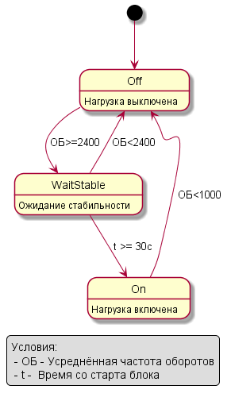
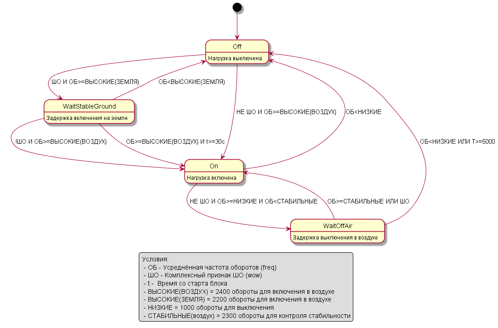

# Генерация графа состояний по исходникам С++


Для получения doxygen html Выполнить скрипты из `scripts` - `generate_puml.bat`, `run_doxygen.bat`. Иллюстрация:

```bash
mkdir bld
cd scripts
python fsm_comment_to_statechart.py ..\src
cd ..\src
doxygen.exe ..\Doxyfile
```

Внимание! Для запуска doxygen нужен установленный plantuml и dot, см. инструкцию [Doxygen Manual: Configuration](https://www.doxygen.nl/manual/config.html#cfg_plantuml_jar_path)

В результате генерации для файла [start_with_annot.cpp](https://github.com/antlas1/fsm/blob/main/src/start_with_annot.cpp) получаем следующий граф:



Для расширенного случая [improved_with_annot.cpp](https://github.com/antlas1/fsm/blob/main/src/improved_with_annot.cpp):


